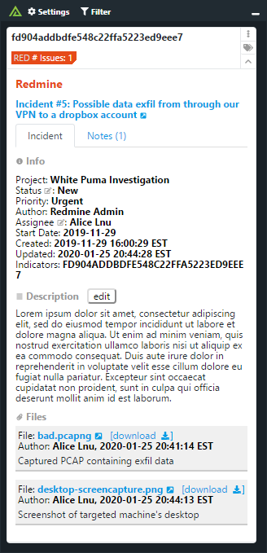
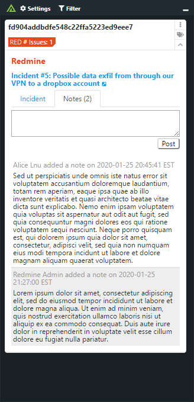
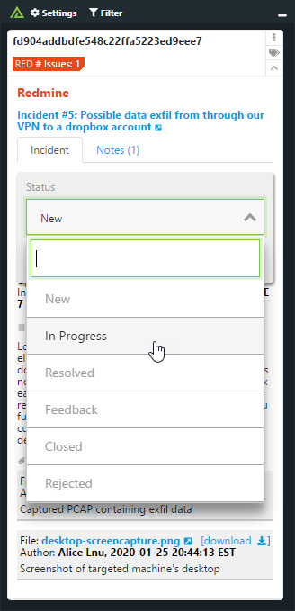

# Polarity Redmine Integration

The Polarity - Redmine integration searches the Redmine open source project management application for issues containing indicators of interest.

|  |  | 
|---| --- | --- |
|*Redmine Issue Information* | *Notes* | *Updating Issue Status* |

To learn more about Redmine, please visit the [official website](https://www.redmine.org/).

> Note that this integration is currently in Beta.

## Configuring Redmine

For this integration to work, you must enable the REST API in Redmine.  To do this, you have to check `Enable REST web service` under Administration -> Settings -> API.

## Redmine Integration Options

### Redmine Server URL

The URL for your Redmine instance to include the schema (i.e., https://) and port (e.g., https://redmine:8080) as necessary

### Redmine Administrator REST APIKey

A REST API Key for your Redmine administrator. This key is used to retrieve user and status information when the integration first starts. The user information is used to populate the Assignee field of the issue. If not provided, the status and assignee fields will not be editable. The Admin API Key is not used for performing searches, editing issues, or adding notes.

> This option should be set to "Only admins can view and edit"

> This option requires restarting the integration after being modified

### Redmine REST APIKey

The REST API Key used to authenticate to your Redmine instance. If left blank, no authentication will be used when communicating with the specified Redmine instance.

You can find your API key by logging into Redmine and navigating to "My Account" and in the right hand panel slicking on "Show" API access key.

> This option should be set to "Users can view and edit" so that each Redmine user authenticates with their own account.  

### Project to Search

The name of a single project to search. If left blank, all projects will be searched.

## Common Error and Warning Messages

### Cannot update status from “\<old status>” to “\<new status>”

If you get this error message while trying to update the status message it could be one of two issues.  The first issue is that Redmine only allows transitions from between certain Statuses.  So for example, your Redmine instance might not allow a status to transition from “Rejected” to “New”.

 The second possibility is that your account (as specified by the Redmine REST APIkey) does not have permission to update the status.

### Cannot update description. Please check your account permissions

If you this message it means the Remine User REST API Key you provided does not have permissions to edit the description of the issue.

### Cannot update assignee from \<username> to \<username>

If you get this error message it means the Redmine User REST API Key you provided in your options does not have permission to change the assignee on the issue in question.

### Resource could not be found

If you see this message it often means that the project you provided under the Project to Search option does not exist or is not accessible.  Ensure you provide
the project name in all lowercase and replace any spaces in the name with dashes.  For example, if your project is named "My Project", you would enter "my-project".

### You do not have permission to perform that action

If you see this message it typically means the Redmine Administrator REST API Key you provided does not have permission to retrieve all users on your Redmine instance or does not have permission to list all issue statuses on your Redmine.  The administrator account tied to the Redmine Administrator REST API Key should have permission to access the following endpoints:

```
GET https://<redmine-server>/users.json
GET https://<redmine-server>/issue_statuses.json
```

### Unexpected status code \<status-code> when attempting HTTP request

If you see this error an unexpected error occurred while trying to query the Redmine server.  Oftentime this can be due to an invalid SSL certificate.  If this is the case, please ensure you set the request.rejectUnauthorzed property in the integration’s config.js file on the server to false.  If you need fruther assistance with configuring or troubleshooting the integration please contact support@polarity.io

## Redmine REST API Limitations

- Redmine does not currently support editing or deleting an existing note via the REST API
- Redmine does not support search filtering on priority or status of an issue via the REST API
- When using special characters in an issue description, the integration will display a warning that the save operation failed

## Polarity

Polarity is a memory-augmentation platform that improves and accelerates analyst decision making. For more information about the Polarity platform please see:

https://polarity.io/
